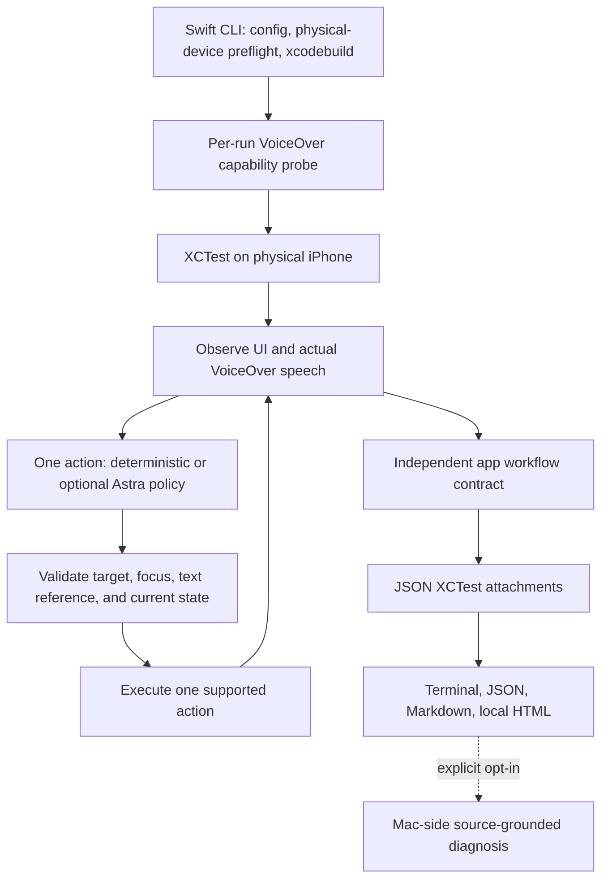

# A11yGate

**Don’t claim accessibility. Prove it.**

Your App Store accessibility claims, tested like code.

A11yGate is a local-first Swift developer tool that asks: **can someone using
VoiceOver actually finish the important tasks in your iOS app?** It combines
workflow execution, machine-readable evidence, independent success checks, and
optional AI-assisted diagnosis.

The long-term goal is **accessibility claims as executable tests**. The current
preview includes a deliberately imperfect SwiftUI app with Login, Create Item,
and Checkout workflows, plus an experimental iOS 27 VoiceOver runner.

**MIT licensed · Swift/SwiftUI · XCTest · Physical iPhone testing · Optional BYOK AI**

[Quick start](#quick-start-no-iphone-or-api-key-needed) ·
[Getting started](docs/GETTING_STARTED.md) ·
[How it works](#architecture) ·
[CLI reference](docs/CLI.md) ·
[Contributing](CONTRIBUTING.md)

> **Experimental developer preview.** The iOS 27 VoiceOver driver, per-run
> capability checks, optional Astra planner, diagnosis, and reports are implemented.
> They compile against Xcode 27. Real iOS 27 execution is still unverified: the
> available physical iPhone 12 runs iOS 26.6.1. Compilation and Mac tests are not
> VoiceOver evidence. See the [verification record](docs/VERIFICATION.md).

## The problem

An app can expose labels and still leave a VoiceOver user unable to complete a
task. A purchase control might be hidden by an ancestor, a modal might trap the
navigation path, or a screen transition might make the next step hard to find.
A list of individually compliant elements does not establish task completion.

A11yGate makes the workflow the unit of testing. It records the path taken, the
observations available at each step, whether the app reached an independently
checked outcome, and what evidence is missing when a result is inconclusive.

| Developer question | A11yGate's role |
|---|---|
| Can the user sign in, create an item, and check out? | Attempt the declared workflows in the selected execution mode |
| Where did this run get blocked? | Preserve observations, attempted actions, and driver errors |
| Did VoiceOver actually announce that? | Identify the speech source; leave unavailable speech absent |
| Did the model just decide it succeeded? | Verify the app's postcondition independently |
| What should I inspect in SwiftUI? | Offer an optional evidence-grounded hypothesis and source suggestion |
| Did the fix help? | Compare matching before/after workflow reports |

Static accessibility audits remain useful for labels, traits, contrast, and other
properties. A11yGate complements them with task-oriented evidence. It does not
replace expert audits, testing by people who use VoiceOver, or broader usability
work, and it does not certify legal compliance.

## Who this is for

- iOS developers who want reproducible evidence for important app workflows.
- Accessibility and QA engineers who need to review how a result was reached.
- Open-source contributors exploring honest assistive-technology automation.
- Teams researching how to support accessibility claims with repeatable tests.

This preview is not a drop-in scanner for arbitrary apps. The CLI currently
builds the bundled synthetic demo. The core exposes an app-adapter contract, but
another app needs its own driver, assertions, and build integration.

## What is available today

| Capability | Implementation and verification |
|---|---|
| SwiftUI demo and functional XCTest baseline | Implemented; earlier broken/fixed runs recorded on a physical iPhone 12 |
| iOS 27 VoiceOver driver and capability probes | Implemented and compiled; physical iOS 27 execution pending |
| Closed-loop Astra planning | Implemented; encrypted localhost/stub tests pass; live provider/device path pending |
| Source-grounded diagnosis | Implemented; citation/source guards tested; live provider calls pending |
| JSON, terminal, Markdown, and HTML reports | Implemented; historical report replay and exports verified |
| Generic app integration | Core contract and guidance available; CLI remains demo-specific |
| CI accessibility gate or legal certification | Not provided by this preview |

The final local verification recorded **35 Mac tests passing**, plus successful
CLI and iOS 27 app/test-target compilation. These are code checks, not proof that
VoiceOver users can complete the demo. Exact conditions are in
[Verification](docs/VERIFICATION.md).

## Quick start: no iPhone or API key needed

Requirements: a Mac with a Swift 6 toolchain. Xcode 27 is the verified toolchain;
its iOS 27 SDK is needed to compile the VoiceOver branch. The CLI targets macOS
14+, but Xcode itself may require a newer macOS version.

```bash
git clone https://github.com/saksham2599/a11ygate.git
cd a11ygate
swift test

# Review a recorded functional run; this does not launch an app.
swift run a11ygate report --input examples/functional-fixed.json

# Generate a local HTML report and open it in your browser.
swift run a11ygate report --input examples/functional-fixed.json \
  --format html --output /private/tmp/a11ygate-example.html
open /private/tmp/a11ygate-example.html
```

The repository is initially private, so cloning requires access to it. This
licensing and documentation preparation does not make the repository public.

The terminal replay should show:

```text
A11yGate — Functional UI baseline

Login                   PASS
Create Item             PASS
Checkout                PASS

VoiceOver readiness: NOT TESTED (functional UI execution only)
```

This is a **historical functional report**, not a fresh VoiceOver run. See
[Getting started](docs/GETTING_STARTED.md) for compilation, device setup, signing,
configuration, and optional cloud features.

## What the demo must prove

```text
                            Broken     Fixed
Login                       PASS       PASS
Create Item                 PASS       PASS
Checkout                    FAIL       PASS
```

This is the **target VoiceOver acceptance result**, not a recorded result.
The actual earlier **functional UI baseline** on iPhone 12/iOS 26.6.1 was:
Login PASS, Create Item PASS, Checkout INCONCLUSIVE. The fixed fixture passed all
three. XCUITest retained the hidden checkout button in its snapshot but marked
it non-hittable; that alone does not prove a VoiceOver failure.

**Demo video placeholder:** a real-device VoiceOver recording, with captions and
transcript, will replace this after the broken/fixed acceptance gate passes.

## Build and test the code now

A Mac with Xcode 27 is needed to compile the new VoiceOver branch. No simulator
is created, booted, or used. The synthetic demo targets iOS 17+; VoiceOver service
execution requires iOS 27 on the physical phone.

```bash
# From this repository:
swift test
swift run a11ygate doctor

# Compile app + tests for physical iOS, without signing, installing, or launching:
xcodebuild build-for-testing \
  -project ios/A11yGateDemo.xcodeproj -scheme A11yGateDemo \
  -destination 'generic/platform=iOS' \
  -derivedDataPath /private/tmp/a11ygate-build \
  CODE_SIGNING_ALLOWED=NO COMPILER_INDEX_STORE_ENABLE=NO
```

Mac tests use synthetic driver states and an encrypted localhost connection to
a stub planner. They call no OpenAI API and produce no device verdicts.

## Run on a supported physical iPhone

These commands are prepared for physical iOS 27 testing. A paired phone,
Developer Mode, local signing team, and a usable device session are required.
The driver remains opt-in until physical acceptance is complete.

```bash
export A11YGATE_TEAM="YOUR_TEAM_ID"
swift run a11ygate probe --device YOUR_DEVICE_ID --output artifacts/probe

swift run a11ygate test --device YOUR_DEVICE_ID --experimental-voiceover \
  --output artifacts/broken
swift run a11ygate test --device YOUR_DEVICE_ID --experimental-voiceover \
  --fixed --output artifacts/fixed
swift run a11ygate compare --before artifacts/broken/report.json \
  --after artifacts/fixed/report.json
```

Each VoiceOver run first tests navigation, speech observation, activation using a
spatially separated decoy, and **XCTest-injected text**. If any capability or its
cleanup fails, workflows do not execute. The runner restores the original
VoiceOver setting on handled completion or error. Abrupt process termination
can prevent cleanup; inspect the phone after an interrupted run.

Text injection is not testing the VoiceOver keyboard. Focus identity is inferred
from a unique label prefix in speech, not a public focused-`XCUIElement` API.
Ambiguous matches, stale observations, and interruptions fail closed.

For an ordinary UI baseline, use `--mode functional`. A functional PASS never
becomes a VoiceOver PASS. Screenshots are opt-in with `--screenshots`; only the
explicit app screenshots are retained, not automatic system captures.

## Configuration

```yaml
voiceover:
  - id: login
    task: Login
    goal: >
      Sign into the demo account using the supplied test credentials.
  - id: create-item
    task: Create Item
    goal: >
      Create an item named Buy Milk.
  - id: checkout
    task: Checkout
    goal: >
      Purchase the item using the demo checkout flow.
```

The CLI currently supports these three IDs in the bundled app. A goal is not a
success assertion: `WorkflowContract` defines independently checked outcomes
and text-reference bindings. See [app adapters](docs/ADAPTERS.md). The YAML reader
supports the shown narrow subset and equivalent JSON; unsupported keys and
structures are rejected. Editing prose does not create an app integration.

## Reports you can inspect

Try the [recorded functional examples](examples/README.md) immediately, without
an iOS device or an API key. They are historical evidence, not a simulated live run.

Every workflow run/preflight writes `report.json`, `report.txt`, `report.md`, and
`report.html`. Executed device runs also retain `.xcresult`, exported JSON
attachments, and build/test logs. JSON v2 records attempted actions, errors,
observations, timestamps, capabilities, coverage, and available Git provenance.
The reader can replay earlier v1 reports.

The HTML report is local, uses no scripts or external resources, escapes UI
content, and provides semantic tables, keyboard-operable disclosure controls,
and a step timeline. Its own VoiceOver usability still needs human review.

```bash
swift run a11ygate report --input artifacts/broken/report.json --format html \
  --output artifacts/broken/review.html
swift run a11ygate report --input artifacts/broken/report.json --format markdown
```

| Result | Meaning |
|---|---|
| PASS | The selected mode's workflow postcondition was observed |
| FAIL | The app adapter established a defined blocker in that mode |
| INCONCLUSIVE | Missing evidence, interruption, invalid/stale action, or exhausted budget |
| UNSUPPORTED | Required capability or explicit experimental opt-in is unavailable |

Exit `0`: passed; `1`: failure; `2`: unsupported, inconclusive, or infrastructure
failure. An XCTest process succeeding alone does not make the gate pass.
The checkout VoiceOver oracle is scoped to sequential navigation between known
fixture landmarks, not every possible rotor, touch-exploration, or keyboard path.

## Optional Astra planning and diagnosis

Deterministic execution needs **no API key**. To request one structured action
per observation from Astra, explicitly enable cloud planning:

```bash
# Set OPENAI_API_KEY securely in your shell; never commit it.
# Both devices must reach the Mac's private IPv4 address on a trusted network.
swift run a11ygate test --device YOUR_DEVICE_ID --experimental-voiceover \
  --planner astra --allow-cloud --agent-host YOUR_MAC_PRIVATE_IPV4 \
  --output artifacts/astra
```

The Mac hosts a short-lived encrypted connection for the synthetic XCTest runner.
Only the Mac calls OpenAI. Per-run AES-GCM keys authenticate requests and replies;
request IDs prevent replayed requests from creating another model call.
The connection is experimental; Mac-to-iPhone networking and local-network
permission behavior still need physical testing. There is no hosted backend.

The model receives the current observation, goal, and recent history, then returns
one action. The engine checks targets, inferred focus, text references, state
freshness, progress, and success independently. Navigation, activation, typing,
and verdict rules remain deterministic. See [architecture](docs/ARCHITECTURE.md).

For a post-run explanation and a narrow source-grounded suggestion:

```bash
# Review both the report and this synthetic source before cloud submission.
swift run a11ygate diagnose --input artifacts/broken/report.json --allow-cloud \
  --source ios/A11yGateDemo/DemoView.swift --output artifacts/broken/diagnosis.json
```

Diagnoses cite validated evidence IDs and identify source only when supplied.
They remain hypotheses, never change the verdict, and never modify code.
API usage sidecars record model, latency, response ID, and token counts when the
provider returns them. The default model is `gpt-6-astra`, configurable with
`A11YGATE_MODEL`. This uses your billed API access, not a consumer subscription.
Calls are not automatically retried. Live OpenAI calls have not been verified.

## Architecture



```text
a11ygate/
├── Sources/
│   ├── A11yGateCore/      # Contracts, actions, engine, evidence, report rendering
│   ├── A11yGateAgent/     # Mac-side OpenAI adapter and encrypted planner server
│   └── A11yGateCLI/       # Configuration, build/run orchestration, report commands
├── ios/
│   ├── A11yGateDemo/      # Synthetic SwiftUI workflows and capability probe UI
│   ├── A11yGateUITests/   # Functional and experimental VoiceOver drivers
│   └── A11yGateDemo.xcodeproj/
├── Tests/                # Mac-only unit and localhost integration tests
├── examples/             # Recorded functional evidence, clearly labeled
├── schemas/              # Action and report JSON schemas
├── scripts/              # Deterministic Xcode project generation
├── docs/                 # Setup, CLI, architecture, limitations, release plan
└── accessibility.yml     # The three declared demo workflows
```

The checked-in Xcode project compiles the same core files used by Swift Package
Manager. After adding files, run `python3 scripts/generate-project.py`.

## Privacy and scope

The sample is entirely synthetic: no account creation, networked purchase,
StoreKit transaction, or personal data. Text actions log references; password
values and known synthetic password speech are redacted. Generic redaction for
arbitrary apps is not implemented. API keys stay on the Mac; the per-run bridge
key is removed from the generated test configuration after normal completion.
Do not share raw test logs/configurations without review. Recordings are not
requested. XCTest may transiently capture system artifacts internally even when
retention is disabled. `store: false` is not a promise of zero provider retention.

A11yGate supplies engineering evidence for declared tasks and tested conditions.
It does not certify legal compliance, endorse an App Store claim, or imply Apple
endorsement. Voice Control, Larger Text, contrast analysis, and other technologies
remain out of scope.

## Next release gates

1. Run the new probes and three real VoiceOver workflows on physical iOS 27.
2. Reproduce the broken/fixed matrix and ordinary-touch usability of the defect.
3. Verify live Astra planning/diagnosis with explicit BYOK consent.
4. Have another iOS developer try an adapter and a VoiceOver user review the demo/report.
5. Record the real demo and prepare the [Product Hunt launch](docs/LAUNCH_PLAN.md).
6. Add physical-device CI only after local acceptance passes.

## Contributing and licensing

A11yGate is MIT licensed. Contributions are welcome in code, documentation,
reproducibility, and accessibility review. Start with [Contributing](CONTRIBUTING.md)
and the [Code of Conduct](CODE_OF_CONDUCT.md). Security-sensitive reports should
follow [Security](SECURITY.md), not include raw credentials or private UI data.

Read [Getting started](docs/GETTING_STARTED.md), [CLI reference](docs/CLI.md),
[Architecture](docs/ARCHITECTURE.md), [Adapters](docs/ADAPTERS.md), and
[Verification](docs/VERIFICATION.md). The [public release checklist](docs/PUBLISHING.md)
keeps repository visibility, preview status, and physical acceptance separate.

[MIT license](LICENSE). No Apple or OpenAI endorsement is implied.
